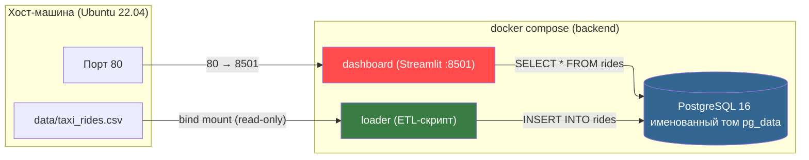
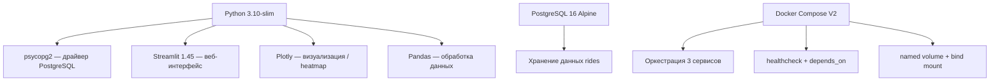
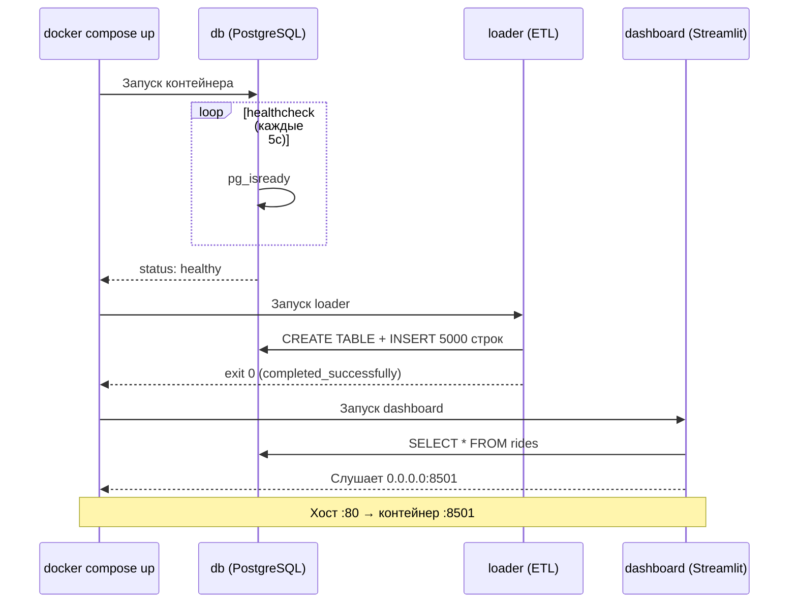

# Лабораторная работа №2. Упаковка многокомпонентного аналитического приложения с помощью Docker и Docker Compose

**Вариант 40** — Логистика / Управление парком такси / Анализ пиковых часов спроса  
**Техническое задание** — прокинуть порт 8501 (Streamlit) на 80-й порт хоста

---

### 1. Проверка состояния
Посмотреть запущенные контейнеры:
```bash
docker ps
```
Посмотреть **все** контейнеры (включая остановленные):
```bash
docker ps -a
```
Посмотреть список всех образов и сколько места они занимают:
```bash
docker images
```
Посмотреть, сколько места занимает Docker (дисковое пространство):
```bash
docker system df
```

---

### 2. Остановка и удаление контейнеров
Остановить **все** запущенные контейнеры одной командой:
```bash
docker stop $(docker ps -aq)
```
Удалить **все** остановленные контейнеры (освобождает имена и немного места):
```bash
docker container prune -f
```
*Или более жесткий вариант (удаляет вообще все контейнеры из списка):*
```bash
docker rm $(docker ps -aq)
```

---

### 3. Удаление образов (очистка места)
Удалить все **неиспользуемые** образы (dangling images):
```bash
docker image prune -a -f
```
Удалить **вообще все** образы (чтобы скачать их заново чистыми):
```bash
docker rmi $(docker images -q) -f
```

---

### 4. Полная очистка системы (Максимальное освобождение места)
Эта команда удаляет:
*   Все остановленные контейнеры
*   Все неиспользуемые сети
*   Все образы, не используемые запущенными контейнерами
*   Кэш сборки

```bash
docker system prune -a -f
```

Если нужно удалить еще и **Volumes** (тома с данными баз данных и т.д.), добавьте флаг `--volumes`:
```bash
docker system prune -a --volumes -f
```

## 1. Архитектура решения



## 2. Технологический стек



## 3. Структура проекта

```
project/
├── docker-compose.yml        # оркестрация сервисов
├── .env                      # переменные окружения (пароли)
├── generate_data.py          # генератор синтетических данных
├── data/
│   └── taxi_rides.csv        # сгенерированный датасет (5 000 строк)
└── app/
    ├── Dockerfile            # образ для loader и dashboard
    ├── .dockerignore         # исключения при сборке
    ├── requirements.txt      # Python-зависимости
    ├── loader.py             # ETL: CSV → PostgreSQL
    └── dashboard.py          # Streamlit: heatmap-дашборд
```

## 4. Описание компонентов

### 4.1 Генератор данных (`generate_data.py`)

Скрипт запускается **один раз на хосте** перед `docker compose up`. Он создаёт файл `data/taxi_rides.csv` с 5 000 синтетическими поездками такси за 2024 год.

Поля датасета:

| Поле | Тип | Описание |
|------|-----|----------|
| ride_id | INT | Уникальный идентификатор поездки |
| timestamp | DATETIME | Дата и время начала поездки |
| hour | INT (0–23) | Час поездки (для агрегации) |
| day_of_week | VARCHAR | День недели (Monday–Sunday) |
| pickup_district | VARCHAR | Район подачи машины |
| dropoff_district | VARCHAR | Район назначения |
| passengers | INT | Количество пассажиров |
| distance_km | FLOAT | Расстояние поездки |
| duration_min | INT | Длительность в минутах |
| fare_rub | INT | Стоимость в рублях |

Распределение часов — **взвешенное**: утренний пик (7–9) и вечерний пик (17–19) генерируются чаще, чтобы имитировать реальную нагрузку такси-парка.

### 4.2 Dockerfile (`app/Dockerfile`)

Соблюдены все требуемые «хорошие практики»:

| Практика | Реализация |
|----------|-----------|
| Конкретная версия образа | `python:3.10-slim` (не `latest`) |
| Непривилегированный пользователь | `useradd -u 1000 appuser`, далее `USER appuser` |
| Кэш слоёв | `COPY requirements.txt` + `pip install` до `COPY *.py` |
| Очистка кэша | `rm -rf /var/lib/apt/lists/*` и `pip --no-cache-dir` |
| `.dockerignore` | Исключены `__pycache__`, `.git`, `venv`, `.env` |

Один и тот же образ используется для двух контейнеров: **loader** (переопределяет `entrypoint`) и **dashboard** (использует CMD по умолчанию).

### 4.3 ETL-загрузчик (`app/loader.py`)

Логика работы:

1. Ожидание доступности PostgreSQL (retry-цикл на случай race condition).
2. Создание таблицы `rides` (`CREATE TABLE IF NOT EXISTS`).
3. Проверка: если данные уже загружены — пропуск (идемпотентность).
4. Чтение `/data/taxi_rides.csv` (bind mount) и `INSERT` в таблицу.
5. Завершение работы (контейнер останавливается).

### 4.4 Dashboard (`app/dashboard.py`)

Streamlit-приложение с тремя визуализациями:

1. **Тепловая карта (heatmap)** — День недели × Час: показывает пиковые часы спроса.
2. **Гистограмма** — распределение поездок по часам суток.
3. **Топ-10 маршрутов** — горизонтальная столбчатая диаграмма.

Фильтры в боковой панели позволяют выбрать районы подачи.

### 4.5 Docker Compose (`docker-compose.yml`)

Три сервиса в единой конфигурации:



Ключевые настройки:

| Требование | Реализация в `docker-compose.yml` |
|------------|-----------------------------------|
| healthcheck БД | `pg_isready` каждые 5 сек, 10 попыток |
| depends_on + condition | loader ждёт `service_healthy`; dashboard ждёт `service_completed_successfully` |
| Именованный том | `pg_data:/var/lib/postgresql/data` — данные БД переживают `docker compose down` |
| Bind mount (read-only) | `./data:/data:ro` — CSV доступен loader-у только для чтения |
| Изолированная сеть | `backend-network` (bridge) — все 3 сервиса |
| Переменные из `.env` | `env_file: .env` — пароли не хардкодятся в YAML |
| Проброс порта | `80:8501` — нестандартный порт Streamlit на 80-й хоста |

## 5. Файл `.env`

```dotenv
POSTGRES_DB=taxi
POSTGRES_USER=taxi_user
POSTGRES_PASSWORD=S3cretP@ss2024
DB_HOST=db
DB_PORT=5432
```

Пароли хранятся только в `.env` и не попадают в `docker-compose.yml` и Docker-образ (`.dockerignore`).

## 6. Инструкция по запуску

```bash
# 1. Перейти в директорию проекта
cd project/

# 2. Сгенерировать данные (однократно)
python3 generate_data.py

# 3. Запустить все сервисы
docker compose up -d --build

# 4. Проверить статус
docker compose ps

# 5. Открыть дашборд в браузере
#    http://localhost:80

# 6. Посмотреть логи
docker compose logs -f

# 7. Остановить и удалить контейнеры (данные БД сохранятся в томе)
docker compose down

# 8. Полная очистка (включая том с данными)
docker compose down -v
```

## 7. Проверка выполнения требований

| # | Требование из ТЗ | Статус |
|---|-------------------|--------|
| 1 | Базовый образ — конкретная версия, не `latest` | ✅ `python:3.10-slim` |
| 2 | Непривилегированный пользователь UID 1000 | ✅ `appuser` |
| 3 | Кэш слоёв: `pip install` до `COPY . .` | ✅ |
| 4 | Очистка кэша `apt` и `pip` | ✅ |
| 5 | `.dockerignore` | ✅ |
| 6 | `depends_on` с `condition: service_healthy` | ✅ |
| 7 | Именованный том для БД | ✅ `pg_data` |
| 8 | Bind mount для данных (read-only) | ✅ `./data:/data:ro` |
| 9 | Изолированная сеть `backend-network` | ✅ |
| 10 | Пароли в `.env`, не в YAML | ✅ |
| 11 | Healthcheck для БД | ✅ `pg_isready` |
| 12 | Loader запускается после healthy БД | ✅ |
| 13 | Проброс 8501 → 80 (ТЗ варианта 40) | ✅ `80:8501` |


