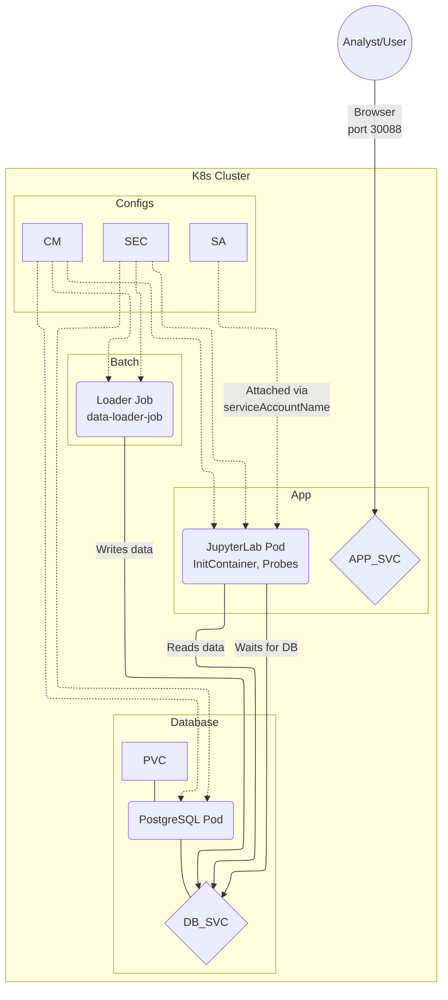

# Лабораторная работа №3. Развертывание аналитического сервиса в кластере Kubernetes

**Выполнил:** [Фамилия Имя Отчество]  
**Группа:** [Номер группы]  
**Вариант:** 40 (Логистика / Taxi Heatmap)  
**Техническое задание (K8s Specific).** Настроить **ServiceAccount** для пода и привязать его в Deployment (подготовка к RBAC).

---

## 1. Цель работы
Получить практические навыки оркестрации контейнеризированных приложений в среде Kubernetes. Выполнить миграцию архитектуры из Docker Compose в K8s, настроить управление конфигурациями (ConfigMaps/Secrets), обеспечить персистентность данных (PVC), настроить проверки жизнеспособности (Probes) и привязать кастомный ServiceAccount.

## 2. Технический стек и окружение
- **ОС:** Ubuntu 24.04 LTS
- **Контейнеризация:** Docker 24.x
- **Оркестрация:** Minikube (Driver: Docker), Kubernetes (kubectl)
- **База данных:** PostgreSQL 15 (Alpine)
- **Язык программирования:** Python 3.10
- **Аналитическая среда:** JupyterLab (scipy-notebook)
- **Библиотеки:** `psycopg2-binary`, `folium`, `pandas`, `sqlalchemy`, `seaborn`, `matplotlib`

---

## 3. Архитектура решения



---

## 4. Исходный код Docker-образов (Локальная сборка)

### Скрипт загрузки данных (Loader)
**Файл `loader/Dockerfile`:**
```dockerfile
FROM python:3.10-slim
RUN pip install psycopg2-binary
COPY loader.py /app/loader.py
CMD ["python", "/app/loader.py"]
```
**Файл `loader/loader.py`:**
```python
import psycopg2, os, random, time

print("Waiting for DB to be fully ready...")
time.sleep(5) 

conn = psycopg2.connect(
    host=os.getenv("DB_HOST"), port=os.getenv("DB_PORT", "5432"),
    dbname=os.getenv("POSTGRES_DB"), user=os.getenv("POSTGRES_USER"),
    password=os.getenv("POSTGRES_PASSWORD")
)
cur = conn.cursor()
cur.execute("CREATE TABLE IF NOT EXISTS taxi_trips (id SERIAL PRIMARY KEY, lat FLOAT, lon FLOAT);")

for _ in range(1000):
    lat = random.uniform(55.65, 55.85)
    lon = random.uniform(37.45, 37.75)
    cur.execute("INSERT INTO taxi_trips (lat, lon) VALUES (%s, %s)", (lat, lon))

conn.commit()
print("Taxi trip data loaded successfully!")
cur.close()
conn.close()
```

### Образ JupyterLab
**Файл `app/Dockerfile`:**
```dockerfile
FROM jupyter/scipy-notebook:latest
RUN pip install psycopg2-binary folium sqlalchemy seaborn matplotlib
ENV JUPYTER_ENABLE_LAB=yes
```

---

## 5. Манифесты Kubernetes

### `k8s/01-config-secret.yaml`
```yaml
apiVersion: v1
kind: Secret
metadata:
  name: db-secret
type: Opaque
data:
  POSTGRES_USER: YWRtaW4=
  POSTGRES_PASSWORD: YWRtaW4=
---
apiVersion: v1
kind: ConfigMap
metadata:
  name: app-config
data:
  POSTGRES_DB: "taxidb"
  DB_HOST: "db-service"
  DB_PORT: "5432"
---
apiVersion: v1
kind: PersistentVolumeClaim
metadata:
  name: postgres-pvc
spec:
  accessModes:
    - ReadWriteOnce
  resources:
    requests:
      storage: 1Gi
---
apiVersion: v1
kind: ServiceAccount
metadata:
  name: taxi-heatmap-sa
  labels:
    app: taxi-app
```

### `k8s/02-pvc.yaml`
```yaml
apiVersion: v1
kind: PersistentVolumeClaim
metadata:
  name: postgres-pvc
spec:
  accessModes:
    - ReadWriteOnce
  resources:
    requests:
      storage: 1Gi
```

### `k8s/03-serviceaccount.yaml`
```yaml
apiVersion: v1
kind: ServiceAccount
metadata:
  name: taxi-heatmap-sa
  labels:
    app: taxi-app
```

### `k8s/04-db.yaml`
```yaml
apiVersion: apps/v1
kind: Deployment
metadata:
  name: db-deployment
spec:
  replicas: 1
  selector:
    matchLabels:
      app: db
  template:
    metadata:
      labels:
        app: db
    spec:
      containers:
      - name: postgres
        image: postgres:15-alpine
        env:
        - name: POSTGRES_USER
          valueFrom:
            secretKeyRef:
              name: db-secret
              key: POSTGRES_USER
        - name: POSTGRES_PASSWORD
          valueFrom:
            secretKeyRef:
              name: db-secret
              key: POSTGRES_PASSWORD
        - name: POSTGRES_DB
          valueFrom:
            configMapKeyRef:
              name: app-config
              key: POSTGRES_DB
        volumeMounts:
        - mountPath: /var/lib/postgresql/data
          name: db-data
      volumes:
      - name: db-data
        persistentVolumeClaim:
          claimName: postgres-pvc
---
apiVersion: v1
kind: Service
metadata:
  name: db-service
spec:
  type: ClusterIP
  selector:
    app: db
  ports:
  - port: 5432
    targetPort: 5432
```

### `k8s/05-app.yaml`
```yaml
apiVersion: apps/v1
kind: Deployment
metadata:
  name: app-deployment
spec:
  replicas: 1
  selector:
    matchLabels:
      app: jupyter
  template:
    metadata:
      labels:
        app: jupyter
    spec:
      serviceAccountName: taxi-heatmap-sa 
      initContainers:
      - name: wait-for-db
        image: busybox:1.28
        command:
        - "sh"
        - "-c"
        - "until nc -z db-service 5432; do echo waiting for db; sleep 2; done;"
      containers:
      - name: jupyter
        image: taxi-jupyter:v1
        imagePullPolicy: Never
        ports:
        - containerPort: 8888
        envFrom:
        - configMapRef:
            name: app-config
        - secretRef:
            name: db-secret
        livenessProbe:
          httpGet:
            path: /api
            port: 8888
          initialDelaySeconds: 15
          periodSeconds: 10
        readinessProbe:
          httpGet:
            path: /api
            port: 8888
          initialDelaySeconds: 10
          periodSeconds: 5
---
apiVersion: v1
kind: Service
metadata:
  name: app-service
spec:
  type: NodePort
  selector:
    app: jupyter
  ports:
  - port: 8888
    targetPort: 8888
    nodePort: 30088
```

### `k8s/06-job.yaml`
```yaml
apiVersion: batch/v1
kind: Job
metadata:
  name: data-loader-job
spec:
  template:
    spec:
      containers:
      - name: loader
        image: taxi-loader:v1
        imagePullPolicy: Never
        envFrom:
        - configMapRef:
            name: app-config
        - secretRef:
            name: db-secret
      restartPolicy: OnFailure
```

---

## 6. Порядок выполнения работы

1. **Запуск:** `minikube start --driver=docker`
2. **Сборка (критический этап):**
   ```bash
   eval $(minikube docker-env)
   docker build -t taxi-loader:v1 ./loader
   docker build -t taxi-jupyter:v1 ./app
   ```
3. **Развертывание:** `kubectl apply -f k8s/`
4. **Проверка доступности:** `minikube service app-service` (откроет браузер).
5. **Логи для входа (token):** `kubectl logs deployment/app-deployment | grep token`
6. **Очистка:** `kubectl delete -f k8s/` -> `minikube delete`

---

## 7. Аналитика в JupyterLab
Код для ячейки Jupyter Notebook:

```python
import os
import pandas as pd
import folium
from folium.plugins import HeatMap
import matplotlib.pyplot as plt
import seaborn as sns
from sqlalchemy import create_engine

# 1. Подключение
db_url = f"postgresql+psycopg2://{os.getenv('POSTGRES_USER')}:{os.getenv('POSTGRES_PASSWORD')}@{os.getenv('DB_HOST')}:{os.getenv('DB_PORT')}/{os.getenv('POSTGRES_DB')}"
engine = create_engine(db_url)

# 2. Загрузка
df = pd.read_sql("SELECT lat, lon FROM taxi_trips;", engine)
print(f"Всего поездок: {len(df)}")

# 3. Визуализация распределения
fig, axes = plt.subplots(1, 2, figsize=(14, 5))
sns.histplot(df['lat'], kde=True, color="skyblue", ax=axes[0])
axes[0].set_title("Распределение широты (Latitude)")
sns.histplot(df['lon'], kde=True, color="salmon", ax=axes[1])
axes[1].set_title("Распределение долготы (Longitude)")
plt.tight_layout()
plt.show()

# 4. Тепловая карта
m = folium.Map(location=[55.75, 37.61], zoom_start=11)
HeatMap(df[['lat', 'lon']].values.tolist(), radius=12, blur=15).add_to(m)
display(m)
```

---

## 8. Чек-лист проверки работоспособности
- [ ] **Кластер:** `minikube status` -> `Running`.
- [ ] **Образы:** Собраны через `eval $(minikube docker-env)`.
- [ ] **Job:** `kubectl get job data-loader-job` -> `COMPLETED`.
- [ ] **ServiceAccount:** `kubectl describe pod -l app=jupyter` подтверждает привязку `taxi-heatmap-sa`.
- [ ] **Персистентность.** Данные не пропадают после удаления пода БД.
- [ ] **Аналитика.** Построены два гистограммных графика и интерактивная карта.


# Очистить среду от результатов работы

Сначала удалить объекты `Kubernetes`, затем очистить образы в реестре Minikube, и при необходимости удалить сам кластер.

Вот алгоритм очистки:

### 1. Удаление всех ресурсов Kubernetes
Если вы находитесь в директории с манифестами (`k8s/`), просто выполните:
```bash
# Удаляет все Deployments, Services, ConfigMaps, Secrets, Jobs и PVC, описанные в файлах
kubectl delete -f k8s/
```

Если вы хотите быть абсолютно уверены, что в пространстве имен `default` ничего не осталось (включая остаточные поды):
```bash
# Удалить все поды, сервисы и деплойменты в пространстве имен default
kubectl delete all --all
# Удалить все persistent volume claims (важно, если нужно стереть данные БД)
kubectl delete pvc --all
```

### 2. Очистка Docker-образов внутри Minikube
Так как вы собирали образы внутри Minikube, они занимают место в его виртуальном Docker-окружении. Чтобы их удалить:

1.  Убедитесь, что сессия настроена на Minikube:
    ```bash
    eval $(minikube docker-env)
    ```
2.  Удалите ваши специфические образы:
    ```bash
    docker rmi taxi-loader:v1 taxi-jupyter:v1
    ```
3.  (Опционально) Очистить все неиспользуемые Docker-образы внутри Minikube:
    ```bash
    docker image prune -a -f
    ```

### 3. Полное удаление кластера (Reset)
Если вам нужно начать работу "с чистого листа" (например, возникли конфликты портов или ошибки конфигурации кластера), самый надежный способ — удалить кластер целиком:

```bash
# Останавливает и полностью удаляет виртуальную машину/контейнер Minikube
minikube delete
```

---

### Сводная таблица команд для "полной зачистки"

| Что удаляем | Команда |
| :--- | :--- |
| **Ресурсы K8s** | `kubectl delete -f k8s/` |
| **Данные (PVC)** | `kubectl delete pvc postgres-pvc` |
| **Образы в Minikube** | `docker rmi taxi-loader:v1 taxi-jupyter:v1` |
| **Весь кластер** | `minikube delete` |

---

### Как проверить, что все удалено?
После выполнения команд очистки выполните:

*   `kubectl get all` — должно вывести только `service/kubernetes` (стандартный сервис API).
*   `kubectl get pvc` — должен вернуть `No resources found`.
*   `minikube image ls` — (после `minikube delete` команда выдаст ошибку, что кластер не найден).

**Рекомендация:** 

Если ваша цель — просто перезапустить проект, достаточно сделать `kubectl delete -f k8s/` и `kubectl apply -f k8s/`. 

Полный `minikube delete` стоит делать только если кластер перестал отвечать или вы хотите полностью освободить ресурсы системы (RAM/Disk).


## Остановить работу сервиса (Deployment)

Не удаляя манифесты и не стирая данные, используется **масштабирование (Scaling) до 0**. Это самый правильный способ «заморозить» работу приложения в Kubernetes.

### 1. Как остановить (масштабировать до 0)
Вам нужно найти имя вашего Deployment и установить количество реплик в 0. Это остановит все поды приложения, но сохранит сам объект Deployment, настройки и (самое важное) PVC с данными БД.

**Команды для остановки:**
```bash
# Остановить приложение (Jupyter)
kubectl scale deployment app-deployment --replicas=0

# Остановить базу данных
kubectl scale deployment db-deployment --replicas=0
```

*После выполнения этих команд `kubectl get pods` будет показывать, что поды завершаются и исчезают.*

---

### 2. Как запустить снова (масштабировать обратно)
Когда потребуется возобновить работу, просто верните количество реплик к 1 (или больше). Kubernetes автоматически создаст новые поды с теми же настройками.

**Команды для запуска:**
```bash
# Запустить базу данных
kubectl scale deployment db-deployment --replicas=1

# Запустить приложение
kubectl scale deployment app-deployment --replicas=1
```

*После этого `kubectl get pods -w` покажет, как поды снова переходят в статус `ContainerCreating` и `Running`.*

---

### Почему это лучше, чем удаление:
1.  **Сохранение конфигурации.** Все ваши ConfigMap, Secret, ServiceAccount и Service остаются на месте.
2.  **Скорость.** Кластеру не нужно перечитывать YAML-файлы, он просто «поднимает» текущую конфигурацию.
3.  **Персистентность.** Если вы настроили PVC (как в ЛР3), данные в базе данных сохранятся, даже если вы масштабировали БД до 0 и выключали кластер.

### Важное примечание про Job:
Ваш `data-loader-job` — это **Job**, а не Deployment. Он не «масштабируется».
*   Если он уже завершил работу (`Completed`), он **не будет потреблять ресурсы процессора или памяти**. Он просто висит как запись в истории кластера. 
*   Если вы хотите запустить загрузчик данных снова, вам нужно сначала удалить старый Job:
    ```bash
    kubectl delete job data-loader-job
    kubectl apply -f k8s/06-job.yaml
    ```

### Способ экономного управления ресурсами кластера:

Для временной остановки аналитического сервиса без удаления инфраструктуры используется масштабирование Deployment до 0 реплик. Это позволяет полностью освободить ресурсы CPU и RAM, при этом сохраняя состояние Persistent Volume и конфигурацию объектов.


## Установка minikube(на ВМ установлено)

### Установка kubectl 

```bash
curl -LO "https://dl.k8s.io/release/$(curl -L -s https://dl.k8s.io/release/stable.txt)/bin/linux/amd64/kubectl" 
sudo install -o root -g root -m 0755 kubectl /usr/local/bin/kubectl 
```

### Установка Minikube 

```bash
curl -LO https://storage.googleapis.com/minikube/releases/latest/minikube-linux-amd64 
sudo install minikube-linux-amd64 /usr/local/bin/minikube
```

### Запуск Minikube с использованием Docker 

```bash
minikube start --driver=docker 
```


