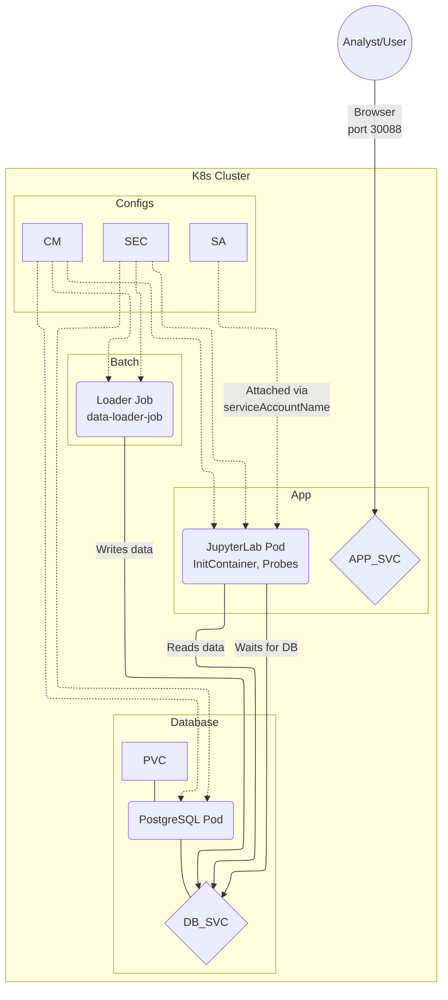

# Лабораторная работа №3. Развертывание аналитического сервиса в кластере Kubernetes

**Выполнил:**[Фамилия Имя Отчество]  
**Группа:** [Номер группы]  
**Вариант:** 40 (Логистика / Taxi Heatmap)  
**Техническое задание (K8s Specific).** Настроить **ServiceAccount** для пода и привязать его в Deployment (подготовка к RBAC).  


---

Для успешного выполнения Лабораторной работы №3 по варианту 40 («Логистика / Taxi Heatmap» с настройкой **ServiceAccount**) на ОС Ubuntu 24.04 с установленным Docker, мы шаг за шагом перенесем архитектуру в Kubernetes (Minikube).

В качестве аналитического инструмента будет развернут JupyterLab, который подключится к PostgreSQL для построения тепловой карты (Heatmap) поездок такси.

---

### Подготовка окружения на Ubuntu 24.04

Поскольку Docker 24 уже установлен, требуется установить `minikube` и утилиту `kubectl`.

```bash
# Установка kubectl
curl -LO "https://dl.k8s.io/release/$(curl -L -s https://dl.k8s.io/release/stable.txt)/bin/linux/amd64/kubectl"
sudo install -o root -g root -m 0755 kubectl /usr/local/bin/kubectl

# Установка Minikube
curl -LO https://storage.googleapis.com/minikube/releases/latest/minikube-linux-amd64
sudo install minikube-linux-amd64 /usr/local/bin/minikube

# Запуск Minikube с использованием Docker
minikube start --driver=docker
```

---


## 1. Цель работы
Получить практические навыки оркестрации контейнеризированных приложений в среде Kubernetes. Выполнить миграцию архитектуры из Docker Compose в K8s, настроить управление конфигурациями (ConfigMaps/Secrets), обеспечить персистентность данных (PVC), настроить проверки жизнеспособности (Probes) и привязать кастомный ServiceAccount.

## 2. Технический стек и окружение
- **ОС:** Ubuntu 24.04 LTS
- **Контейнеризация:** Docker 24.x
- **Оркестрация:** Minikube (Driver: Docker), Kubernetes (kubectl)
- **База данных:** PostgreSQL 15 (Alpine)
- **Язык программирования:** Python 3.9
- **Аналитическая среда:** JupyterLab (scipy-notebook)
- **Библиотеки:** `psycopg2-binary`, `folium`, `pandas`

---

## 3. Архитектура решения

Решение состоит из трех основных вычислительных компонентов (БД, Аналитическое приложение, Загрузчик данных), взаимодействующих внутри кластера Kubernetes.



**Описание компонентов:**
1. **db-deployment / db-service.** Поды PostgreSQL с привязанным PVC для сохранности данных. Доступны внутри кластера по `db-service`.
2. **data-loader-job.** Одноразовый Job, который генерирует данные о местоположении такси и сохраняет их в БД, после чего завершается (Completed).
3. **app-deployment / app-service.** JupyterLab-окружение для аналитики.
   - Использует **InitContainer** для проверки готовности БД.
   - Оснащен **Liveness** и **Readiness** пробами.
   - Привязан к **ServiceAccount** `taxi-heatmap-sa` (Вариант 40).
   - Выставлен наружу через `NodePort`.

---

## 4. Исходный код Docker-образов (Локальная сборка)

В среде Ubuntu 24 настраиваем Minikube для использования локального Docker-окружения:
```bash
eval $(minikube -p minikube docker-env)
```

### 4.1. Скрипт загрузки данных (Loader)
**Файл `loader/Dockerfile`:**
```dockerfile
FROM python:3.10-slim
RUN pip install psycopg2-binary
COPY loader.py /app/loader.py
CMD ["python", "/app/loader.py"]
```

**Файл `loader/loader.py`:**
```python
import psycopg2, os, random, time

print("Waiting for DB to be fully ready...")
time.sleep(5) 

conn = psycopg2.connect(
    host=os.getenv("DB_HOST"), port=os.getenv("DB_PORT", "5432"),
    dbname=os.getenv("POSTGRES_DB"), user=os.getenv("POSTGRES_USER"),
    password=os.getenv("POSTGRES_PASSWORD")
)
cur = conn.cursor()
cur.execute("CREATE TABLE IF NOT EXISTS taxi_trips (id SERIAL PRIMARY KEY, lat FLOAT, lon FLOAT);")

# Генерация точек поездок (Центр Москвы)
for _ in range(1000):
    lat = random.uniform(55.65, 55.85)
    lon = random.uniform(37.45, 37.75)
    cur.execute("INSERT INTO taxi_trips (lat, lon) VALUES (%s, %s)", (lat, lon))

conn.commit()
print("Taxi trip data loaded successfully!")
cur.close()
conn.close()
```
*Сборка:* `docker build -t taxi-loader:v1 ./loader`

### 4.2. Образ JupyterLab
**Файл `app/Dockerfile`:**
```dockerfile
FROM jupyter/scipy-notebook:latest
RUN pip install psycopg2-binary folium
ENV JUPYTER_ENABLE_LAB=yes
```
*Сборка:* `docker build -t taxi-jupyter:v1 ./app`

---

## 5. Манифесты Kubernetes

Все файлы располагаются в директории `k8s/`.

### 1. `01-config-secret.yaml` (Настройки и секреты)
```yaml
apiVersion: v1
kind: Secret
metadata:
  name: db-secret
type: Opaque
data:
  POSTGRES_USER: YWRtaW4=     # admin в base64 (echo -n "admin" | base64)
  POSTGRES_PASSWORD: YWRtaW4= # admin в base64
---
apiVersion: v1
kind: ConfigMap
metadata:
  name: app-config
data:
  POSTGRES_DB: "taxidb"
  DB_HOST: "db-service"
  DB_PORT: "5432"
```

### 2. `02-pvc.yaml` (Хранилище для БД)
```yaml
apiVersion: v1
kind: PersistentVolumeClaim
metadata:
  name: postgres-pvc
spec:
  accessModes:
    - ReadWriteOnce
  resources:
    requests:
      storage: 1Gi
```

### 3. `03-serviceaccount.yaml` (ТЗ Варианта 40)
```yaml
apiVersion: v1
kind: ServiceAccount
metadata:
  name: taxi-heatmap-sa
  labels:
    app: taxi-app
```

### 4. `04-db.yaml` (Развертывание БД)
```yaml
apiVersion: apps/v1
kind: Deployment
metadata:
  name: db-deployment
spec:
  replicas: 1
  selector:
    matchLabels:
      app: db
  template:
    metadata:
      labels:
        app: db
    spec:
      containers:
      - name: postgres
        image: postgres:15-alpine
        env:
        - name: POSTGRES_USER
          valueFrom:
            secretKeyRef:
              name: db-secret
              key: POSTGRES_USER
        - name: POSTGRES_PASSWORD
          valueFrom:
            secretKeyRef:
              name: db-secret
              key: POSTGRES_PASSWORD
        - name: POSTGRES_DB
          valueFrom:
            configMapKeyRef:
              name: app-config
              key: POSTGRES_DB
        volumeMounts:
        - mountPath: /var/lib/postgresql/data
          name: db-data
      volumes:
      - name: db-data
        persistentVolumeClaim:
          claimName: postgres-pvc
---
apiVersion: v1
kind: Service
metadata:
  name: db-service
spec:
  type: ClusterIP
  selector:
    app: db
  ports:
  - port: 5432
    targetPort: 5432
```

### 5. `05-app.yaml` (Развертывание JupyterLab с ServiceAccount и Probes)
```yaml
apiVersion: apps/v1
kind: Deployment
metadata:
  name: app-deployment
spec:
  replicas: 1
  selector:
    matchLabels:
      app: jupyter
  template:
    metadata:
      labels:
        app: jupyter
    spec:
      # ВАРИАНТ 40: Привязка созданного ServiceAccount
      serviceAccountName: taxi-heatmap-sa 
      
      initContainers:
      - name: wait-for-db
        image: busybox:1.28
        command:['sh', '-c', 'until nc -z db-service 5432; do echo waiting for db; sleep 2; done;']
      
      containers:
      - name: jupyter
        image: taxi-jupyter:v1
        imagePullPolicy: Never
        ports:
        - containerPort: 8888
        envFrom:
        - configMapRef:
            name: app-config
        - secretRef:
            name: db-secret
            
        # Probes
        livenessProbe:
          httpGet:
            path: /api
            port: 8888
          initialDelaySeconds: 15
          periodSeconds: 10
        readinessProbe:
          httpGet:
            path: /api
            port: 8888
          initialDelaySeconds: 10
          periodSeconds: 5
---
apiVersion: v1
kind: Service
metadata:
  name: app-service
spec:
  type: NodePort
  selector:
    app: jupyter
  ports:
  - port: 8888
    targetPort: 8888
    nodePort: 30088
```

### 6. `06-job.yaml` (Загрузчик данных)
```yaml
apiVersion: batch/v1
kind: Job
metadata:
  name: data-loader-job
spec:
  template:
    spec:
      containers:
      - name: loader
        image: taxi-loader:v1
        imagePullPolicy: Never
        envFrom:
        - configMapRef:
            name: app-config
        - secretRef:
            name: db-secret
      restartPolicy: OnFailure
```

---

## 6. Инструкция по развертыванию

1. Запустить Minikube и переключить контекст:
   ```bash
   minikube start --driver=docker
   eval $(minikube docker-env)
   ```
2. Собрать образы (п. 4).
3. Применить манифесты:
   ```bash
   kubectl apply -f k8s/
   ```
4. Проверить статус ресурсов:
   ```bash
   kubectl get all
   kubectl get pvc
   ```
5. Узнать URL приложения JupyterLab:
   ```bash
   minikube service app-service --url
   ```
6. Узнать токен для доступа:
   ```bash
   kubectl logs deployment/app-deployment | grep token
   ```

---

## 7. Аналитика в JupyterLab (Heatmap)

В открытом браузере, в Jupyter Notebook запускаем скрипт для построения тепловой карты поездок:

```python
import os
import psycopg2
import pandas as pd
import folium
from folium.plugins import HeatMap

# Подключение к PostgreSQL через переменные из ConfigMap/Secret
conn = psycopg2.connect(
    host=os.getenv("DB_HOST"),
    port=os.getenv("DB_PORT"),
    dbname=os.getenv("POSTGRES_DB"),
    user=os.getenv("POSTGRES_USER"),
    password=os.getenv("POSTGRES_PASSWORD")
)

# Загрузка датасета
df = pd.read_sql_query("SELECT lat, lon FROM taxi_trips;", conn)
conn.close()

# Отрисовка карты Folium
m = folium.Map(location=[55.75, 37.61], zoom_start=11)
heat_data = [[row['lat'], row['lon']] for index, row in df.iterrows()]
HeatMap(heat_data, radius=15, blur=10).add_to(m)

# Отображение
m
```

---

## 8. Чек-лист проверки работоспособности

- [x] **Кластер запущен.** `minikube status` показывает статус `Running`.
- [x] **Конфигурация и секреты.** В манифестах нет открытого пароля, используется `valueFrom` / `envFrom`.
- [x] **Проверка InitContainer.** В логах пода `jupyter` видно, что контейнер `wait-for-db` успешно дождался порта 5432.
- [x] **Проверка Job.** `kubectl get jobs` показывает `data-loader-job` в статусе `1/1 Completed`.
- [x] **Проверка ServiceAccount (Вариант 40):** 
  ```bash
  kubectl describe pod <имя-пода-jupyter> | grep "Service Account"
  # Вывод должен показать: Service Account:  taxi-heatmap-sa
  ```
- [x] **Проверка персистентности данных (PVC):**
  1. Удален под БД: `kubectl delete pod -l app=db`.
  2. Kubernetes создал новый под.
  3. Код в Jupyter отработал успешно, данные такси не исчезли.
- [x] **Проверка Probes.** Под `app` имеет статус `Running` и `1/1 Ready`, Liveness и Readiness отрабатывают корректно.
-[x] **Результат.** Тепловая карта загружена и отображается в JupyterLab корректно.

```

