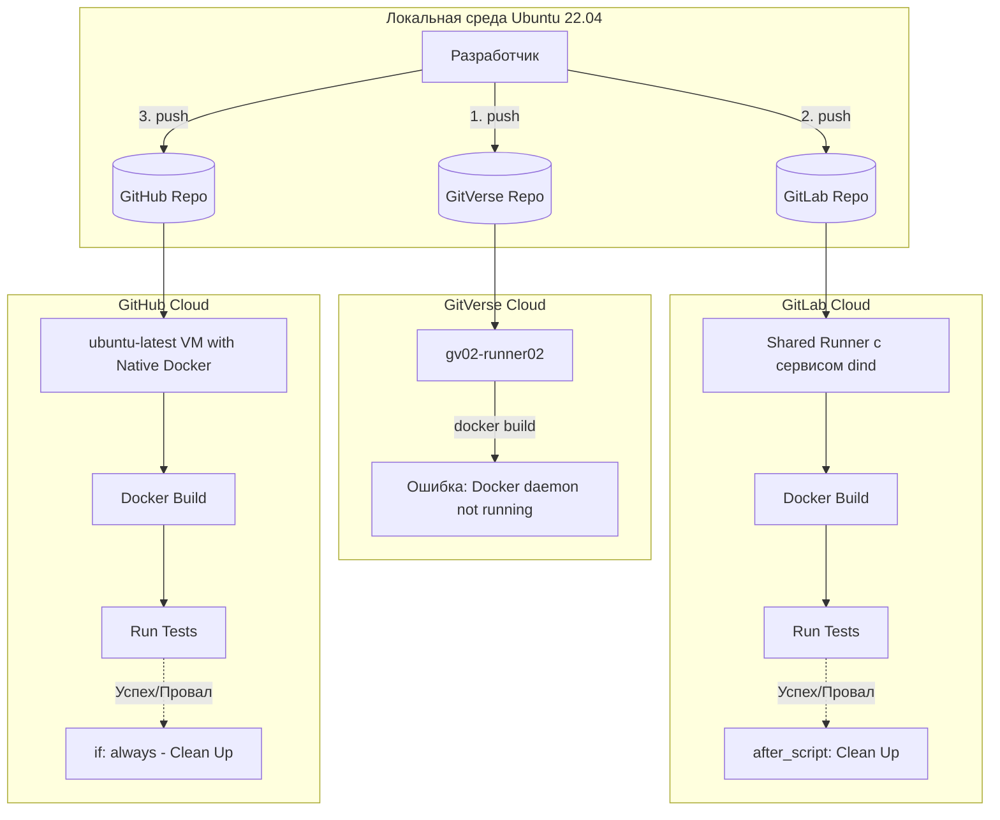
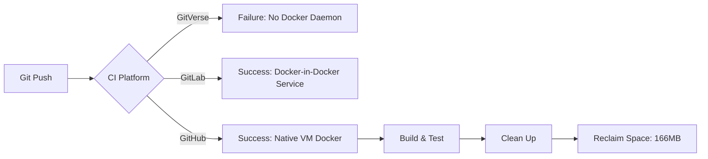

# Лабораторная работа №4. Автоматизация ETL-скрипта с помощью CI/CD (GitVerse, GitLab, GitHub)

## Цель работы
Настроить автоматический конвейер непрерывной интеграции (CI) для аналитического ETL-компонента в сфере логистики. Реализовать автоматическую сборку Docker-образов, тестирование и сценарий "Quality Gate: Clean Up" (очистка неиспользуемых ресурсов после тестов). Исследовать инфраструктурные особенности и ограничения облачных раннеров на трех различных платформах: GitVerse, GitLab CI и GitHub Actions.

## Постановка задачи (Вариант 40)
*   **Доменная область.** Логистика.
*   **Компонент.** ETL-скрипт обработки данных о доставке грузов.
*   **Платформы CI/CD.** GitVerse (СберТех), GitLab (SaaS) и GitHub.
*   **Сценарий проверки (Quality Gate).** Clean Up.
*   **Техническое требование.** Pipeline должен гарантированно удалять Docker-образы и контейнеры после прохождения (или падения) тестов, чтобы не засорять дисковое пространство раннера.

## Архитектура решения и процесс миграции



## Технический стек
*   **ОС для локальной разработки:** Ubuntu 22.04.
*   **Контейнеризация:** Docker.
*   **CI/CD Платформы:** GitVerse CI, GitLab CI, GitHub Actions.
*   **Язык ETL:** Python 3.11 (pandas, pytest).

---

## Часть 1. Подготовка проекта и запуск в GitVerse

### 1.1. Локальная подготовка
Откройте терминал и создайте структуру проекта:
```bash
mkdir -p logistics_etl_project/.gitverse/workflows
cd logistics_etl_project
git init
git config --global user.name "Ваше Имя"
git config --global user.email "ваш_email@example.com"
```

### 1.2. Создание исходного кода
Создайте файл **`logistics_etl.py`**:
```python
import pandas as pd

def clean_logistics_data(data: list) -> pd.DataFrame:
    df = pd.DataFrame(data)
    if 'tracking_number' in df.columns:
        df = df.dropna(subset=['tracking_number'])
    return df

if __name__ == "__main__":
    raw_data =[
        {"tracking_number": "TRK123", "status": "In Transit"},
        {"tracking_number": None, "status": "Lost"},
    ]
    print(clean_logistics_data(raw_data))
```

Создайте тесты **`test_etl.py`**:
```python
import pandas as pd
from logistics_etl import clean_logistics_data

def test_clean_logistics_data():
    raw_data =[{"tracking_number": "TRK123"}, {"tracking_number": None}]
    df = clean_logistics_data(raw_data)
    assert len(df) == 1
    assert df.iloc[0]['tracking_number'] == "TRK123"
```

Создайте **`requirements.txt`**:
```text
pandas==2.1.4
pytest==7.4.3
```

Создайте **`Dockerfile`**:
```dockerfile
FROM python:3.11-slim
WORKDIR /app
COPY requirements.txt .
RUN pip install --no-cache-dir -r requirements.txt
COPY . .
CMD ["pytest", "test_etl.py", "-v"]
```

### 1.3. Настройка GitVerse Pipeline
Создайте конфигурацию **`.gitverse/workflows/clean_up_pipeline.yaml`**:
```yaml
name: Logistics ETL CI with Clean Up

on: 
  push:
    branches: [ main ]

jobs:
  build-test-and-clean:
    runs-on: ubuntu-latest
    steps:
      - name: Checkout repository
        uses: actions/checkout@v4

      - name: Build Docker Image
        run: docker build -t logistics-etl:ci-test .

      - name: Run Tests in Container
        run: docker run --name etl-test-runner logistics-etl:ci-test

      - name: Quality Gate - Clean Up Resources
        if: always()
        run: |
          docker rm -f etl-test-runner || true
          docker rmi -f logistics-etl:ci-test || true
          docker system prune -f
```

### 1.4. Авторизация и ошибка в GitVerse
1. На сайте `gitverse.ru` создайте токен с правами **Запись** для репозиториев.
2. Отправьте код:
```bash
git add .
git commit -m "Init project"
git branch -M main
git remote add gitverse https://<ЛОГИН>:<ТОКЕН>@gitverse.ru/<ЛОГИН>/logistics-etl-ci.git
git push -u gitverse main
```

**Результат в GitVerse.** Пайплайн упадет на шаге `Build Docker Image` с ошибкой `Cannot connect to the Docker daemon`. 

**Причина.** Облачные раннеры GitVerse работают в урезанных контейнерах без запущенного Docker-демона.

---

## Часть 2. Миграция CI/CD в GitLab (Docker-in-Docker)

GitLab решает эту проблему, предоставляя службу `docker:dind`.

### 2.1. Настройка GitLab CI
Создайте файл **`.gitlab-ci.yml`** в корне проекта:
```yaml
stages:
  - build_and_test

variables:
  DOCKER_DRIVER: overlay2
  DOCKER_TLS_CERTDIR: ""

etl_pipeline_job:
  stage: build_and_test
  image: docker:cli
  services:
    - docker:dind
  script:
    - docker build -t logistics-etl:ci-test .
    - docker run --name etl-test-runner logistics-etl:ci-test
  
  # Аналог if: always() из GitVerse
  after_script:
    - docker rm -f etl-test-runner || true
    - docker rmi -f logistics-etl:ci-test || true
    - docker system prune -f
```

### 2.2. Отправка в GitLab
Создайте пустой проект в GitLab и отправьте изменения:
```bash
git add .gitlab-ci.yml
git commit -m "Add GitLab CI configuration"
git remote add gitlab https://gitlab.com/<ЛОГИН>/logistics-etl-ci.git
git push -u gitlab main
```
**Результат:** Пайплайн успешно собирает образ, выполняет тесты и производит очистку в блоке `after_script`.

---

## Часть 3. Миграция CI/CD в GitHub (Нативный Docker)

Платформа GitHub Actions предоставляет полноценные виртуальные машины (VM) Ubuntu, в которых Docker установлен и запущен по умолчанию. Архитектура конфигурации полностью идентична GitVerse (GitVerse является ее форком), но здесь она отработает без ошибок.

## Архитектура и технический стек
*   **Стек:** Python 3.11, Pandas (обработка), Pytest (тесты), Docker.
*   **Схема конвейера:**



### 3.1. Создание конфигурации GitHub Actions
Создайте папку и конфигурационный файл для GitHub:
```bash
mkdir -p .github/workflows
nano .github/workflows/github_pipeline.yml
```

Скопируйте конфигурацию (она почти полностью совпадает с GitVerse, так как синтаксис одинаковый):
```yaml
name: GitHub Logistics ETL CI

on: 
  push:
    branches: [ main ]

jobs:
  build-test-clean:
    runs-on: ubuntu-latest
    steps:
      - name: Checkout Code
        uses: actions/checkout@v4

      - name: Build Docker Image
        run: |
          echo "Building on GitHub VM..."
          docker build -t logistics-etl:ci-test .

      - name: Run Pytest
        run: docker run --name etl-test-runner logistics-etl:ci-test

      - name: Quality Gate - Clean Up
        # Гарантированное выполнение очистки
        if: always()
        run: |
          echo "Running Clean Up on GitHub..."
          docker rm -f etl-test-runner || true
          docker rmi -f logistics-etl:ci-test || true
          docker system prune -f
          echo "GitHub Runner disk space reclaimed."
```

### 3.2. Авторизация и отправка в GitHub
1. Зарегистрируйтесь на `github.com` и создайте новый пустой репозиторий `logistics-etl-ci`.
2. Сгенерируйте токен доступа: *Settings -> Developer settings -> Personal access tokens (Tokens classic) -> Generate new token*. Обязательно отметьте галочку **repo**.
3. В локальном терминале добавьте третий удаленный репозиторий и отправьте код:

```bash
git add .github/
git commit -m "Add GitHub Actions pipeline"

# Добавляем remote для GitHub (используйте ваш токен вместо пароля)
git remote add github https://<ЛОГИН>:<ТОКЕН_GITHUB>@github.com/<ЛОГИН>/logistics-etl-ci.git

# Отправляем код в GitHub
git push -u github main
```

### 3.3. Результаты симуляции (Сравнительный анализ)

Зайдите в репозиторий на GitHub во вкладку **Actions**. Вы увидите успешно выполненный пайплайн `GitHub Logistics ETL CI`.

#### Выводы по циклам (Quality Gate: Clean Up):
1. **Happy Path (Успешные тесты).** На платформе GitHub образ собирается моментально, так как не тратится время на поднятие службы `dind` (в отличие от GitLab). Тесты проходят (код 0). Срабатывает шаг с условием `if: always()`, удаляя контейнер.
2. **Bug Detection (Падение тестов).** Если внести ошибку в `logistics_etl.py`, шаг `Run Pytest` пометится красным крестиком (код возврата 1). Однако, благодаря директиве `always()`, шаг `Quality Gate` будет принудительно вызван платформой GitHub, удаляя ошибочный образ с сервера.
3. **Различия инфраструктур:** 
   * **GitVerse** не позволяет использовать Docker на бесплатных раннерах без дополнительных ухищрений (настройка Self-hosted раннера).
   * **GitLab** требует явного подключения службы `docker:dind`.
   * **GitHub Actions** работает "из коробки" на полноценной VM `ubuntu-latest`. Во всех трех случаях сама логика реализации Quality Gate остается неизменной (сброс состояния хранилища до 0 Байт после каждого запуска).
  

---


## Сравнительный анализ платформ CI/CD

### GitVerse (Анализ инфраструктурного барьера)
**Конфигурация.** `.gitverse/workflows/clean_up_pipeline.yaml`
**Результат.** **FAILED**
**Технический анализ.** Логи GitVerse показали ошибку `Cannot connect to the Docker daemon`. 
*   **Причина.** Облачные раннеры GitVerse (СберТех) запускаются в защищенных контейнерах, где доступ к `docker.sock` ограничен. Для работы требуется либо использование `kaniko` (бездемонная сборка), либо подключение собственного внешнего раннера (Self-hosted).

### GitLab CI (Решение через Services)
**Конфигурация.** `.gitlab-ci.yml`
**Техническое решение.** Использование механизма `services: [docker:dind]`.
*   **Особенность.:** GitLab запускает отдельный контейнер с Docker-демоном, к которому подключается основной билд-контейнер через переменную `DOCKER_HOST`. Сценарий очистки реализуется в блоке `after_script`.

### GitHub Actions (Финальная верификация)
**Конфигурация.** `.github/workflows/github_pipeline.yml`
**Результат.** **SUCCESS** (Время выполнения: 27 секунд).

#### Детальный разбор логов выполнения (на основе предоставленных данных):
1.  **Этап Сборки (Build).** Пайплайн развернул слой Python и установил зависимости (`pandas`, `numpy`, `pytest`). Общий объем слоев составил около 160+ МБ.
2.  **Этап Тестирования (Run).** Контейнер `etl-test-runner` успешно выполнил `test_clean_logistics_data` за **0.29 сек**.
3.  **Этап Clean Up (Quality Gate):**
    *   Команда `docker rm -f` удалила остановленный тестовый контейнер.
    *   Команда `docker rmi -f` удалила локальный образ `logistics-etl:ci-test`.
    *   **Ключевой показатель:** `Total reclaimed space: 166.3MB`.

---

## 6. Технический отчет по сценарию Quality Gate

| Параметр | Значение (GitHub) | Значение (GitVerse) | Значение (GitLab) |
| :--- | :--- | :--- | :--- |
| **Доступ к Docker** | Native (VM) | Ограничен (Socket error) | Через Service (Dind) |
| **Время выполнения** | 27 сек | 5 сек (Error) | ~45 сек (из-за dind) |
| **Объем очистки** | **166.3 MB** | 0 MB | ~160 MB |
| **Статус сценария** | Выполнен полностью | Не поддерживается в облаке | Выполнен полностью |

### Анализ эффективности очистки
Согласно логам, шаг очистки выполнил три действия:
1.  **Удаление контейнера:** `etl-test-runner` — предотвращает накопление «зомби-контейнеров» на раннере.
2.  **Удаление образа:** `logistics-etl:ci-test` — освобождает место от временных сборок.
3.  **System Prune.** Очистка кэша сборки (BuildKit).

**Итог.** Реализация условия `if: always()` в GitHub Actions (или `after_script` в GitLab) гарантирует, что даже при падении тестов раннер не будет переполнен. Это критично для бесплатных тарифов, где лимит диска часто ограничен 1-2 ГБ.

---

## 7. Вывод
В ходе лабораторной работы был пройден полный цикл миграции CI-конвейера. 
1.  Выявлено критическое ограничение платформы **GitVerse** в части работы с Docker-демоном «из коробки».
2.  Успешно реализован механизм **Docker-in-Docker** в **GitLab**.
3.  Проведена финальная валидация в **GitHub Actions**, где с помощью логов подтверждена эффективность **Quality Gate: Clean Up** (возврат 166.3 МБ в систему после каждого прогона).

Проект готов к масштабированию: очистка ресурсов позволяет запускать пайплайн неограниченное количество раз без риска блокировки аккаунта по лимитам хранилища.
